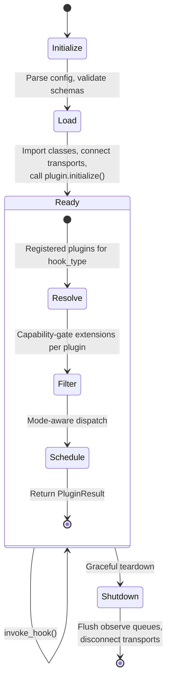
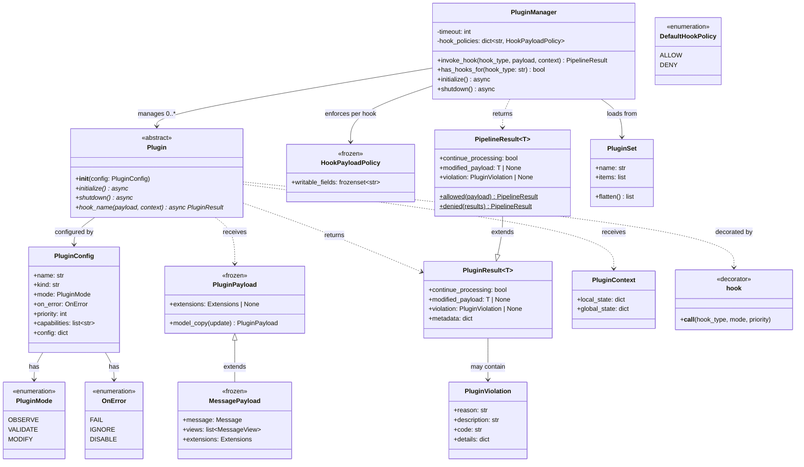

# Plugin Framework (CPEX) Specification

**Version**: 2.0
**Related**: [CMF Message Specification](../specs/cmf-message-spec.md)

## Introduction

This document specifies a hook-based extensibility framework that enables policy enforcement, observability, and extensibility through composable, capability-gated plugins that attach to named hook points in a host system's execution lifecycle.

The framework separates four concerns:

* **Payload model** — what plugins operate on, defined as well-typed models.
* **Plugin definition** — what a plugin does, declared via code or configuration.
* **Execution semantics** — how the pipeline dispatches plugins and handles their results.
* **Capability gating** — which payload extensions each plugin can observe and modify.

The framework operates on any `PluginPayload` subclass. CMF `Message` and `MessageView` are built-in payload types for the common case of message-level policy enforcement, but the same plugin model, scheduling, and capability gating apply to any domain-specific payload.

For the canonical message model, extensions, and `MessageView` abstraction, see the [CMF Message Specification](../specs/cmf-message-spec.md).

## Table of Contents

1. [Design Goals](#1-design-goals)
2. [Framework Model](#2-framework-model)
   - 2.1 [Key Types](#21-key-types)
   - 2.2 [PluginPayload](#22-pluginpayload)
   - 2.3 [CMF Integration](#23-cmf-integration)
   - 2.4 [PluginResult & PluginViolation](#24-pluginresult--pluginviolation)
3. [Plugin Definition](#3-plugin-definition)
   - 3.1 [Function Hooks](#31-function-hooks)
   - 3.2 [Class-Based Plugins](#32-class-based-plugins)
   - 3.3 [Plugin Sets](#33-plugin-sets)
   - 3.4 [Registration & Scoping](#34-registration--scoping)
4. [Plugin Behavior](#4-plugin-behavior)
   - 4.1 [Plugin Modes](#41-plugin-modes)
   - 4.2 [Error Handling](#42-error-handling)
   - 4.3 [Copy-on-Write Semantics](#43-copy-on-write-semantics)
5. [Execution Model](#5-execution-model)
   - 5.1 [Hook Invocation](#51-hook-invocation)
   - 5.2 [Scheduling](#52-scheduling)
6. [Capability-Gated Extensions](#6-capability-gated-extensions)
   - 6.1 [Capability Model](#61-capability-model)
   - 6.2 [Extension Filtering](#62-extension-filtering)
   - 6.3 [Capability in Practice](#63-capability-in-practice)
7. [Configuration](#7-configuration)
   - 7.1 [Plugin Configuration](#71-plugin-configuration)
   - 7.2 [External Plugins](#72-external-plugins)
   - 7.3 [YAML Configuration](#73-yaml-configuration)
   - 7.4 [Global Settings](#74-global-settings)
8. [Plugin Manager & Lifecycle](#8-plugin-manager--lifecycle)
   - 8.1 [Plugin Context](#81-plugin-context)
   - 8.2 [Manager Lifecycle & Execution Flow](#82-manager-lifecycle--execution-flow)
   - 8.3 [Class Diagram](#83-class-diagram)
9. [Properties](#9-properties)

## 1. Design Goals

* **Payload-agnostic** — Operates on any typed, frozen Pydantic payload. CMF messages are a built-in payload type, not the only one. Domain-specific hooks define domain-specific payloads.
* **Composable** — Multiple plugins attach to the same hook point and execute in priority order. Plugins are grouped into reusable sets.
* **Minimal intrusion** — Plugins are opt-in. Without registered plugins, hook invocations are no-ops with zero overhead.
* **Fail-safe** — Plugin failures are isolated. Error handling behavior is configurable per-plugin, independent of mode.
* **Least privilege** — Plugins declare capabilities. The framework filters payload extensions per-plugin so each sees only the data it needs.
* **Safe mutation** — Plugins that modify payloads operate on copies. The original payload is preserved for audit, rollback, and parallel inspection.

## 2. Framework Model

This section introduces the type system that the rest of the specification builds on. Understanding these types first makes the behavioral contracts, execution model, and capability system that follow concrete and unambiguous.

### 2.1 Key Types

| Type | Role |
|------|------|
| `PluginPayload` | Base type for all hook payloads. Frozen (immutable) Pydantic model with optional extensions. Plugins use `model_copy(update={...})` to propose modifications. CMF [Message](../specs/cmf-message-spec.md) defines a canonical representation for messages. |
| `PluginResult[T]` | Generic result: `continue_processing`, `modified_payload`, `violation`, `metadata`. |
| `PipelineResult[T]` | Aggregate result from a full hook invocation. Wraps `PluginResult` with factory methods (`allowed`, `denied`). |
| `PluginViolation` | Structured policy failure: `reason`, `description`, `code`, `details`. |
| `PluginMode` | Enumeration: `OBSERVE`, `VALIDATE`, `MODIFY`. |
| `OnError` | Enumeration: `FAIL`, `IGNORE`, `DISABLE`. |
| `Plugin` | Abstract base class with `initialize()`, `shutdown()`, and `@hook`-decorated methods. |
| `PluginConfig` | Plugin declaration: `name`, `kind`, `mode`, `on_error`, `priority`, `capabilities`, `config`. |
| `PluginContext` | Per-invocation execution state: `local_state`, `global_state`. |
| `PluginManager` | Singleton managing plugin lifecycle and dispatch. |
| `PluginSet` | Composable, reusable grouping of related hooks and plugins. |
| `@hook` | Decorator for registering async functions or methods as hook handlers. |
| `@plugin` | Convenience decorator for marking a plain class as a multi-hook plugin. |

### 2.2 PluginPayload

`PluginPayload` is the generic base type for all hook payloads. It is a frozen Pydantic model that optionally carries CMF extensions, making capability gating available to any payload type, including CMF messages.

```python
class PluginPayload(BaseModel, frozen=True):
    """Base type for all hook payloads.

    Frozen (immutable). Plugins propose modifications via model_copy(update={...}).
    Subclasses define domain-specific fields.
    """
    extensions: Extensions | None = None
```

**Design rationale:**

* **Frozen** — Payloads are immutable by default. Mutation is only possible through copy-on-write in `modify` mode.
* **Optional extensions** — Payloads that carry extensions get automatic capability filtering. Payloads without extensions skip filtering entirely.
* **Pydantic** — Provides validation, serialization, and `model_copy()` for COW semantics.

Domain-specific payloads subclass `PluginPayload` and add their own fields:

```python
class CompletionPayload(PluginPayload):
    """Hook payload for LLM completion lifecycle."""
    prompt: str
    model: str
    parameters: dict[str, Any] = {}

class ToolInvocationPayload(PluginPayload):
    """Hook payload for tool execution lifecycle."""
    tool_name: str
    arguments: dict[str, Any]
    server_id: str | None = None
```

These payloads participate in the same plugin pipeline — same modes, same scheduling, same result types. When they carry extensions, capability gating works identically to CMF message payloads.

### 2.3 CMF Integration

CMF `Message` and `MessageView` are the primary built-in payload types. They are used by the standard hook points that process message-level interactions — the common case for policy enforcement, content scanning, and observability in agentic systems.

```python
class MessagePayload(PluginPayload):
    """CMF message payload — the primary built-in type.

    Wraps a CMF Message and its decomposed views for policy evaluation.
    Extensions are always present (inherited from the message).
    """
    message: Message
    views: list[MessageView]
    extensions: Extensions          # Always present for CMF payloads
```

`MessagePayload` provides plugins with both the wire-format `Message` and the decomposed `MessageView` list. Plugins that need to scan individual tool calls, resources, or prompt requests operate on views. Plugins that need the full message structure (e.g., for serialization or forwarding) operate on the message directly.

**How CMF payloads relate to generic payloads:**

| Aspect | `PluginPayload` | `MessagePayload` |
|--------|-----------------|-------------------|
| Extensions | Optional | Always present |
| Capability filtering | Applied when extensions exist | Always applied |
| `MessageView` accessors | Not available | Available via `views` |
| COW tier enforcement | Applied when extensions exist | Always enforced |

Plugins can be written against `PluginPayload` for maximum generality, or against `MessagePayload` (or any other subclass) when they need domain-specific fields:

```python
# Generic — works with any payload that has extensions
@hook("any_hook", mode="validate")
async def check_labels(payload: PluginPayload, ctx):
    if payload.extensions and "RESTRICTED" in payload.extensions.security.labels:
        return block("Restricted content")

# CMF-specific — accesses message views
@hook("message_pre_send", mode="validate")
async def check_tool_calls(payload: MessagePayload, ctx):
    for view in payload.views:
        if view.kind == "tool_call" and view.name == "execute_sql":
            if not view.has_permission("db.read"):
                return block("Missing db.read permission")
```

### 2.4 PluginResult & PluginViolation

A plugin evaluates a payload and returns a `PluginResult`, which expresses one of three decisions:

| Decision | `continue_processing` | `modified_payload` | `violation` | Effect |
|----------|----------------------|-------------------|-------------|--------|
| **Allow** | `True` | `None` | `None` | Payload continues unchanged |
| **Deny** | `False` | `None` | `PluginViolation(...)` | Pipeline halts; violation reported |
| **Modify** | `True` | `PluginPayload(...)` | `None` | Modified copy replaces the current payload |

These outcomes form the complete set of plugin decisions. Returning `None` is equivalent to Allow. Plugins cannot alter control flow beyond these three outcomes.

```python
class PluginResult(Generic[T]):
    continue_processing: bool = True
    modified_payload: T | None = None
    violation: PluginViolation | None = None
    metadata: dict[str, Any] = {}
```

The `PluginViolation` type carries structured policy failure information:

```python
class PluginViolation:
    reason: str                    # Short human-readable summary
    description: str | None        # Optional detailed explanation
    code: str | None               # Machine-readable identifier
    details: dict[str, Any]        # Structured diagnostic data
```

Violations propagate to the caller and may be logged, surfaced to users, or used for auditing.

## 3. Plugin Definition

The framework supports three mechanisms for defining plugins, in order of simplicity.

### 3.1 Function Hooks

The simplest plugin is a plain async function decorated with `@hook`:

```python
from framework import hook, block

@hook("generation_pre_call", mode="validate", priority=10)
async def enforce_budget(payload, ctx):
    if estimate_tokens(payload) > 4000:
        return block("Token budget exceeded")

@hook("tool_post_invoke", mode="observe")
async def log_tool_call(payload, ctx):
    print(f"[tool] {payload.tool_name} → {payload.latency_ms}ms")
```

**Parameters:**

- `hook_type: str` — the hook point name (required).
- `mode: str` — `"observe"`, `"validate"` (default), or `"modify"`.
- `priority: int` — lower numbers execute first (default: `50`).

The `block()` helper is shorthand for returning a deny result:

```python
def block(reason: str, *, description: str = None, code: str = "", details: dict = None) -> PluginResult:
    return PluginResult(
        continue_processing=False,
        violation=PluginViolation(
            reason=reason, description=description, code=code, details=details or {}
        ),
    )
```

### 3.2 Class-Based Plugins

For plugins that need shared state across multiple hooks, use the `@plugin` decorator or subclass the `Plugin` base class.

**`@plugin` decorator** — marks a plain class as a multi-hook plugin. Parameters:

- `name: str` — unique plugin identifier (required).
- `priority: int` — default priority for all hooks in this plugin (default: `50`). Per-handler `@hook` priorities override this.
- `on_error: str` — default error handling for all hooks (default: `"fail"`).
- `capabilities: list[str]` — extension capabilities for all hooks (default: `[]`).

```python
from framework import plugin, hook, PluginResult

@plugin("pii-redactor", priority=5)
class PIIRedactor:
    def __init__(self, patterns: list[str] | None = None):
        self.patterns = patterns or [r"\d{3}-\d{2}-\d{4}"]

    @hook("generation_pre_call", mode="modify")
    async def redact_input(self, payload, ctx):
        redacted = self._redact(payload.prompt)
        if redacted != payload.prompt:
            modified = payload.model_copy(update={"prompt": redacted})
            return PluginResult(continue_processing=True, modified_payload=modified)

    @hook("generation_post_call", mode="modify")
    async def redact_output(self, payload, ctx):
        ...

    def _redact(self, text: str) -> str:
        for pattern in self.patterns:
            text = re.sub(pattern, "[REDACTED]", text)
        return text
```

**`Plugin` base class** — for plugins that need lifecycle hooks (`initialize`/`shutdown`):

```python
from framework import Plugin, hook

class MetricsCollector(Plugin):
    def __init__(self, endpoint: str):
        self.endpoint = endpoint
        self._buffer = []

    async def initialize(self):
        self._client = await connect(self.endpoint)

    async def shutdown(self):
        await self._client.flush(self._buffer)
        await self._client.close()

    @hook("generation_post_call", mode="observe")
    async def collect(self, payload, ctx):
        self._buffer.append({"latency": payload.latency_ms})
```

### 3.3 Plugin Sets

`PluginSet` groups related hooks and plugins into composable, reusable units:

```python
from framework import PluginSet

security = PluginSet("security", [
    enforce_budget,
    PIIRedactor(patterns=[r"\d{3}-\d{2}-\d{4}"]),
])

observability = PluginSet("observability", [
    log_tool_call,
    MetricsCollector(endpoint="https://..."),
])
```

`PluginSet` accepts standalone hook functions, `@plugin`-decorated class instances, `Plugin` subclass instances, and other `PluginSet` instances (nesting). Sets are inert containers; they do not register anything themselves. Registration happens when they are passed to `register()` or associated with a specific block of code using a context manager.

### 3.4 Registration & Scoping

**Global** — fires for all hook invocations:

```python
from framework import register

register(observability)
register([security, observability])
register(enforce_budget)
```

**Context manager** — fires within a `with` block:

Plugins can be activated for a specific block of code using context managers:

```python
from framework import plugin_scope

# Factory — accepts any mix of hooks, plugins, and sets
with plugin_scope(enforce_budget, PIIRedactor()):
    result = generate("Name the planets.")
# plugins deregistered here

# @plugin instance as context manager
guard = PIIRedactor()
with guard:
    result = generate("Summarize the customer record.")

# PluginSet as context manager
with observability:
    result = generate("What is the capital of France?")
```

All forms support `async with`. Scopes stack cleanly — each exit deregisters only its own plugins. The same instance cannot be active in two overlapping scopes simultaneously; create separate instances for concurrent use.

## 4. Plugin Behavior

### 4.1 Plugin Modes

Each plugin declares a **mode**, which defines its authority level over pipeline execution and payload mutation.

```python
class PluginMode(StrEnum):
    OBSERVE = "observe"
    VALIDATE = "validate"
    MODIFY = "modify"
```

Modes are strictly hierarchical in authority:

```
OBSERVE  <  VALIDATE  <  MODIFY
```

Each mode grants specific capabilities:

| Mode | Can Observe | Can Modify | Can Deny | Pipeline Waits | Typical Use Cases |
|------|-------------|------------|----------|----------------|-------------------|
| `observe` | Yes | No | No | No | Audit logging, telemetry, analytics |
| `validate` | Yes | No | Yes | Yes | Authorization, policy enforcement, rate limiting |
| `modify` | Yes | Yes (COW) | Yes | Yes | Redaction, normalization, header injection |

#### Mode semantics

**`observe`**

* Receives a read-only view of the payload
* Cannot modify or deny execution
* Executes asynchronously
* Results are ignored
* Used for side effects only

**`validate`**

* Receives a read-only view of the payload
* May allow or deny execution
* Cannot modify the payload
* Used for policy enforcement and validation

**`modify`**

* Receives a mutable copy of the payload (copy-on-write)
* May modify, allow, or deny execution
* Modifications propagate to downstream plugins and the caller

#### Scheduling model (derived from mode)

Execution scheduling is determined automatically from mode:

* **Observe plugins** — Executed asynchronously. Never block the pipeline. May run in parallel.
* **Validate plugins** — Executed in parallel. Pipeline waits for completion. Safe parallelism due to read-only access.
* **Modify plugins** — Executed sequentially. Each plugin receives the output of the previous plugin. Ensures deterministic transformation order.

Plugin authors do not control scheduling directly. Scheduling is derived from mode to guarantee safety and correctness.

#### Mode progression and rollout

Modes support progressive deployment:

```
observe  →  validate  →  modify
 async      enforce      enforce + correct
```

This allows operators to:

* Start with observe mode to measure impact
* Promote to validate mode to enforce policy
* Promote to modify mode to automatically correct violations

### 4.2 Error Handling

Error handling behavior is controlled by the `on_error` attribute, independent of mode.

```python
class OnError(StrEnum):
    FAIL = "fail"
    IGNORE = "ignore"
    DISABLE = "disable"
```

| Value | Behavior |
|-------|----------|
| `fail` | Pipeline halts and error propagates |
| `ignore` | Error logged; pipeline continues |
| `disable` | Plugin automatically disabled after error |

#### Semantics

**`fail` (default)**

* Plugin failures halt execution
* Ensures fail-safe enforcement
* Recommended for security-critical plugins

**`ignore`**

* Plugin failures are logged
* Pipeline continues execution
* Recommended for observability and non-critical plugins

**`disable`**

* Plugin is automatically transitioned to a disabled state
* Prevents repeated failures from affecting pipeline stability
* Useful for experimental or external plugins

#### Error isolation

Each plugin executes in isolation:

* Exceptions do not crash the host system
* Failures are contained to the plugin invocation
* Behavior is controlled exclusively by `on_error`

Example configuration:

```yaml
plugins:
  - name: audit_logger
    mode: observe
    on_error: ignore

  - name: rbac_authorizer
    mode: validate
    on_error: fail

  - name: pii_redactor
    mode: modify
    on_error: disable
```

### 4.3 Copy-on-Write Semantics

Only `modify` plugins receive mutable payloads. All modifications use copy-on-write semantics:

* Original payload is never mutated
* Modified copies propagate forward
* Original remains available for audit and rollback

For payloads that carry extensions, COW copies respect extension mutability tiers: immutable extensions are shared by reference, monotonic extensions are validated add-only, guarded extensions require write capabilities. See [CMF Message Specification — Mutability Tiers](../specs/cmf-message-spec.md#31-mutability-tiers). Payloads without extensions skip tier enforcement.

This ensures:

* Deterministic execution
* Safe parallel validation
* Full auditability
* Isolation between plugins

#### COW validation

After a modify plugin returns a modified payload, the pipeline validates the modification against extension mutability tiers using `validate_cow(original, modified, capabilities)`. The validation checks:

| Tier | Validation Rule |
|------|----------------|
| **Immutable** | `original.ext is modified.ext` (reference equality). Any change is rejected. |
| **Monotonic** | `original.labels ⊆ modified.labels`. Removal of any element is rejected. |
| **Guarded** | Modification is accepted only if the plugin declared the corresponding write capability (e.g., `write_headers` for `ext.http`). |
| **Mutable** | No validation. Any change is accepted. |

If validation fails, the pipeline rejects the modification and applies the plugin's `on_error` behavior. The original payload is preserved.

```python
@hook("message_pre_send", mode="modify")
async def redact_pii(payload: MessagePayload, ctx):
    if contains_pii(payload.message.get_text_content()):
        redacted_content = redact(payload.message.content)
        redacted_message = payload.message.model_copy(update={"content": redacted_content})
        redacted_labels = payload.extensions.security.labels | {"PII_REDACTED"}
        redacted_security = payload.extensions.security.model_copy(update={"labels": redacted_labels})
        redacted_extensions = payload.extensions.model_copy(update={"security": redacted_security})
        modified = payload.model_copy(update={
            "message": redacted_message,
            "extensions": redacted_extensions,
        })
        return PluginResult(modified_payload=modified)
    return PluginResult()  # Allow, no modification
```

## 5. Execution Model

### 5.1 Hook Invocation

Hook point names (e.g., `generation_pre_call`, `tool_post_invoke`, `message_pre_send`) are defined by the host system that integrates the plugin framework. This specification does not prescribe a fixed set of hook points — each host defines the hook points appropriate to its execution lifecycle and places `invoke_hook()` calls at those sites. Hook names used in examples throughout this specification are illustrative.

The pipeline dispatches plugins through a single entry point placed at hook invocation sites:

```python
async def invoke_hook(
    hook_type: str, payload: PluginPayload, context: PluginContext
) -> PluginResult:
    # 1. Resolve registered plugins for this hook_type
    # 2. For each plugin in priority order:
    #       if mode is observe   → dispatch asynchronously with read-only view
    #       elif mode is validate → await with read-only view
    #       elif mode is modify   → await with mutable copy
    # 3. Return the aggregate result
```

`PipelineResult` is a convenience wrapper around `PluginResult` returned by the pipeline after all hooks for an invocation have run. It aggregates individual plugin results and provides factory methods for the common outcomes:

* `PipelineResult.allowed(payload)` — all plugins allowed; returns the (possibly modified) payload.
* `PipelineResult.denied(results)` — at least one plugin denied; carries the violation(s).

Callers treat `PipelineResult` identically to `PluginResult` — it exposes the same `continue_processing`, `modified_payload`, and `violation` fields.

The caller (typically a framework base class) invokes the hook and processes one of three outcomes:

1. **Continue unchanged**: `PluginResult(continue_processing=True)` with no `modified_payload`.
2. **Continue with modified payload**: `PluginResult(continue_processing=True, modified_payload=...)`. The caller uses the modified payload in place of the original.
3. **Block execution**: `PluginResult(continue_processing=False, violation=...)`. The caller halts and reports the violation.

Hooks cannot redirect control flow or alter the calling method's logic beyond these outcomes. This is enforced by the `PluginResult` type.

### 5.2 Scheduling

The scheduler determines plugin execution order and concurrency based solely on plugin mode and priority. Plugin authors do not control scheduling directly.

Scheduling is designed to maximize parallelism while preserving correctness and deterministic transformation ordering.

#### Scheduling rules by mode

Plugins are scheduled according to their mode:

| Mode | Execution | Concurrency | Mutability |
|------|-----------|-------------|------------|
| `observe` | Asynchronous | Parallel | Read-only |
| `validate` | Awaited | Parallel | Read-only |
| `modify` | Awaited | Sequential | Copy-on-write |

Execution guarantees:

* Observe plugins never block the pipeline.
* Validate plugins execute concurrently and the pipeline waits for all results.
* Modify plugins execute sequentially to preserve transformation ordering.

These guarantees ensure safe parallelism and deterministic behavior.

#### Execution phases

Given a priority-ordered list of plugins, the scheduler processes plugins in phases based on mode:

1. Dispatch all observe plugins asynchronously
2. Execute validate plugins in parallel and await completion
3. Execute modify plugins sequentially
4. Return the final result

Observe plugins may still be running after the pipeline completes.

#### Transformation chaining

Modify plugins form a deterministic transformation chain.

Each modify plugin receives the output of the previous modify plugin:

```
Original Payload
    ↓
Modify Plugin A
    ↓
Modified Payload A
    ↓
Modify Plugin B
    ↓
Modified Payload B
    ↓
Final Payload
```

If any modify plugin denies execution, the pipeline halts immediately and downstream plugins are not executed.

#### Priority and ordering

Plugins execute in ascending priority order (lower value executes first).

Within each mode:

* Observe plugins may execute in any order
* Validate plugins may execute in any order
* Modify plugins execute strictly in priority order

Default priority is `50`.

Example ordering:

```
P=0   observe    audit_logger
P=10  validate   rbac_authorizer
P=20  validate   quota_enforcer
P=30  modify     pii_redactor
P=40  modify     header_injector
```

Execution schedule:

```
1. Dispatch audit_logger (async)
2. Execute rbac_authorizer and quota_enforcer (parallel)
3. Execute pii_redactor (sequential)
4. Execute header_injector (sequential)
```

Priority can be set per-handler, per-plugin, or per-set. Most specific wins: per-handler > per-plugin > per-set.

#### Short-circuit behavior

The pipeline halts immediately if any validate or modify plugin returns a deny result.

Observe plugins cannot deny execution and never affect pipeline control flow.

Example:

```
validate_plugin_A → allow
validate_plugin_B → deny
modify_plugin_C   → not executed
```

Result: execution stops at validate_plugin_B.

#### Hook payload policies

Each hook point may declare a `HookPayloadPolicy` that constrains which payload fields modify plugins are allowed to change. The policy lists the writable fields; modifications to any other field are rejected by COW validation.

```python
class HookPayloadPolicy(frozen=True):
    writable_fields: frozenset[str]    # Payload fields modify plugins may change
```

When no policy is registered for a hook, the `DefaultHookPolicy` determines behavior:

| Default | Behavior |
|---------|----------|
| `ALLOW` | All payload fields are writable (default) |
| `DENY` | No payload fields are writable; modify plugins are rejected at registration |

Hook payload policies are registered on the `PluginManager` and are independent of plugin capabilities — capabilities control *extension* visibility, while hook policies control *field-level* write scope.

#### Capability filtering and isolation

Before invocation, the framework constructs a capability-filtered view of the payload for each plugin. Filtering applies to any `PluginPayload` that carries extensions (see [§6.2](#62-extension-filtering)). Payloads without extensions skip this step.

This ensures:

* Plugins can only access declared extensions
* Validate plugins cannot modify payloads
* Modify plugins can only modify authorized extensions
* Observe plugins cannot mutate state

Each plugin invocation is isolated and receives its own filtered view.

#### Example scheduling timeline

Given:

```
observe:  metrics, audit_log
validate: rbac, quota
modify:   redact, normalize
```

Execution timeline:

```
time →
│
├─ metrics        (async) ────────────────►
├─ audit_log      (async) ────────────────►
│
├─ rbac           (parallel) ──────┐
├─ quota          (parallel) ──────┘
│
├─ redact         (sequential) ───►
│
├─ normalize      (sequential) ───►
│
└─ return result
```

Observe plugins may continue executing after the result is returned.

#### Determinism guarantees

The scheduler guarantees deterministic outcomes:

* Validate plugins cannot modify payloads, so execution order does not affect results
* Modify plugins execute sequentially, ensuring consistent transformations
* Observe plugins cannot affect pipeline state

This ensures reproducible execution independent of system concurrency.

#### Zero-overhead fast path

If no plugins are registered for a hook, invocation returns immediately without allocation, scheduling, or copying.

This ensures negligible overhead when the framework is unused.

## 6. Capability-Gated Extensions

Plugins declare which extensions they need. The pipeline builds payload views with only the granted extensions visible — ungated extensions appear as `None`. Capability gating applies to any `PluginPayload` that carries extensions, not only CMF messages.

For the full extension model and mutability tiers, see [CMF Message Specification — Extensions](../specs/cmf-message-spec.md#3-extensions).

### 6.1 Capability Model

```
┌──────────────────────────────────────────────────────────────────┐
│  Base (always available, no capability required)                  │
│  Content: kind, content, uri, name, args, mime_type, size        │
│  Semantic: action, is_pre, is_post, role                         │
│  Request: environment, request_id, timestamp                     │
│  Informational: completion, provenance, mcp, llm, framework      │
├──────────────────────────────────────────────────────────────────┤
│  Read capabilities (control extension visibility on views):      │
│  + read_subject          → ext.security.subject (id, type)       │
│  + read_roles            → ext.security.subject.roles            │
│  + read_teams            → ext.security.subject.teams            │
│  + read_claims           → ext.security.subject.claims           │
│  + read_permissions      → ext.security.subject.permissions      │
│  + read_headers          → ext.http.headers (sanitized)          │
│  + read_labels           → ext.security.labels                   │
│  + read_objects          → ext.security.objects                   │
│  + read_data             → ext.security.data                     │
│  + read_agent            → ext.agent (input, session, etc.)      │
├──────────────────────────────────────────────────────────────────┤
│  Write capabilities (control COW modification rights):           │
│  + write_headers         → modify ext.http.headers               │
│  + write_custom          → modify ext.custom                     │
└──────────────────────────────────────────────────────────────────┘
```

A plugin that only needs content for scanning gets no subject, no headers, no labels. A plugin doing role-based authorization declares `read_subject` + `read_roles` and gets exactly that.

The base tier and informational extensions shown above apply to CMF `MessageView` accessors. Informational extensions (`completion`, `provenance`, `mcp`, `llm`, `framework`) are always visible because they carry no security-sensitive data — they describe the message's origin and processing context. The `custom` extension requires `write_custom` to modify but is always readable. For non-CMF payloads, the base tier includes the payload's own fields; capability gating controls only the extensions.

### 6.2 Extension Filtering

The pipeline filters extensions per-plugin before dispatch. No intermediate context object is needed — the extensions themselves are the gating surface. This filter applies to any `PluginPayload` whose `extensions` field is not `None`.

```python
class ExtensionFilter:
    def __init__(self, capabilities: list[str]):
        self.caps = set(capabilities)

    def filter(self, extensions: Extensions) -> Extensions:
        """Return a filtered copy with only granted extensions visible."""
        filtered = Extensions()

        # Base tier — always visible
        filtered.request = extensions.request

        # Capability-gated: subject and security fields
        if extensions.security:
            sec = None
            if "read_subject" in self.caps and extensions.security.subject:
                subject = extensions.security.subject
                sec = SecurityExtension(
                    subject=SubjectExtension(
                        id=subject.id,
                        type=subject.type,
                        roles=subject.roles if "read_roles" in self.caps else None,
                        permissions=subject.permissions if "read_permissions" in self.caps else None,
                        teams=subject.teams if "read_teams" in self.caps else None,
                        claims=subject.claims if "read_claims" in self.caps else None,
                    ),
                )
            if "read_labels" in self.caps:
                sec = sec or SecurityExtension()
                sec.labels = extensions.security.labels
            if "read_objects" in self.caps:
                sec = sec or SecurityExtension()
                sec.objects = extensions.security.objects
            if "read_data" in self.caps:
                sec = sec or SecurityExtension()
                sec.data = extensions.security.data
            filtered.security = sec

        if "read_headers" in self.caps:
            filtered.http = extensions.http
        if "read_agent" in self.caps:
            filtered.agent = extensions.agent

        # Immutable informational extensions — always visible
        filtered.completion = extensions.completion
        filtered.provenance = extensions.provenance
        filtered.mcp = extensions.mcp
        filtered.llm = extensions.llm
        filtered.framework = extensions.framework

        # Custom — always readable, writable with write_custom
        filtered.custom = extensions.custom

        return filtered
```

Ungated extensions are `None` on the view. Existing `MessageView` accessors handle this naturally — `view.roles` returns an empty set if the subject extension was not granted, `view.has_role("admin")` returns `False`.

### 6.3 Capability in Practice

The same tool call viewed by three plugins with different capabilities:

**Content-only plugin** (no capabilities):
```json
{
  "kind": "tool_call",
  "action": "execute",
  "is_pre": true,
  "name": "execute_sql",
  "uri": "tool://db-server/execute_sql",
  "content": "{\"query\": \"SELECT * FROM users\"}",
  "arguments": {"query": "SELECT * FROM users"},
  "context": {
    "environment": "production"
  }
}
```

**Authorization plugin** (`read_subject` + `read_roles`):
```json
{
  "kind": "tool_call",
  "action": "execute",
  "is_pre": true,
  "name": "execute_sql",
  "uri": "tool://db-server/execute_sql",
  "content": "{\"query\": \"SELECT * FROM users\"}",
  "arguments": {"query": "SELECT * FROM users"},
  "context": {
    "environment": "production",
    "security": {
      "subject": {
        "id": "user-alice",
        "type": "user",
        "roles": ["developer", "db-reader"]
      }
    }
  }
}
```

**Full-context plugin** (all capabilities):
```json
{
  "kind": "tool_call",
  "action": "execute",
  "is_pre": true,
  "name": "execute_sql",
  "uri": "tool://db-server/execute_sql",
  "content": "{\"query\": \"SELECT * FROM users\"}",
  "arguments": {"query": "SELECT * FROM users"},
  "context": {
    "environment": "production",
    "request_id": "req-7f2a",
    "security": {
      "subject": {
        "id": "user-alice",
        "type": "user",
        "roles": ["developer", "db-reader"],
        "teams": ["platform"],
        "permissions": ["tools.execute", "db.read"],
        "claims": {"sub": "user-alice", "department": "engineering"}
      },
      "labels": ["internal"]
    },
    "headers": {"x-request-id": "req-7f2a", "x-forwarded-for": "10.0.1.5"},
    "agent": {
      "input": "Show me all users",
      "session_id": "sess-9f3a",
      "conversation_id": "conv-17eb",
      "turn": 4
    }
  }
}
```

## 7. Configuration

### 7.1 Plugin Configuration

Each plugin is described by a `PluginConfig`:

```python
class PluginConfig:
    name: str                          # Unique plugin identifier
    kind: str                          # Class path or "external"
    description: str | None = None     # Human-readable purpose
    author: str | None = None          # Maintainer or team
    version: str | None = None         # Semantic version
    tags: list[str] = []               # Searchable categorization
    mode: PluginMode = PluginMode.VALIDATE
    on_error: OnError = OnError.FAIL   # Error handling behavior
    priority: int = 50                 # Execution order (lower = first)
    capabilities: list[str] = []       # Extension capabilities (see 6.1)
    config: dict[str, Any] = {}        # Plugin-specific settings
```

**`kind`** — For native plugins, this is the class path (e.g., `plugins.security.rate_limiter.RateLimiter`). The framework dynamically imports and instantiates the class. For external plugins, use `"external"` — connection details are specified separately.

**`mode`** — The plugin's authority level: `observe`, `validate`, or `modify` (see [4.1](#41-plugin-modes)).

**`on_error`** — Error handling behavior: `fail`, `ignore`, or `disable` (see [4.2](#42-error-handling)).

**`capabilities`** — Extension capabilities the plugin requires (see [6.1](#61-capability-model)). The pipeline filters extensions before dispatching. Ungated extensions are `None`.

**`priority`** — Controls execution order. Lower numbers run first. Plugins at the same priority may be parallelized when their modes permit.

### 7.2 External Plugins

External plugins run as separate processes — MCP servers, HTTP services, or WASM modules. The framework serializes the capability-filtered payload and sends it to the external plugin. The plugin returns a `PluginResult` as JSON. External plugins never see extensions they have not been granted.

```yaml
plugins:
  - name: openai_moderation
    kind: "external"
    description: "OpenAI content moderation"
    capabilities: [read_subject, read_labels]
    priority: 30
    mode: validate
    on_error: fail
    mcp:
      proto: "streamablehttp"
      url: "http://moderation-plugin:3000/mcp"
```

Supported transports:

| Field | Transport | Description |
|-------|-----------|-------------|
| `proto` | all | Protocol: `stdio`, `sse`, `streamablehttp`, `websocket` |
| `url` | HTTP-based | Service URL |
| `uds` | streamablehttp | Unix domain socket path |
| `script` | stdio | Script path to execute |
| `cmd` | stdio | Command array |
| `env` | stdio | Environment variable overrides |
| `cwd` | stdio | Working directory |

### 7.3 YAML Configuration

For deployment-time overrides, plugins can be loaded from YAML. This is useful for enabling/disabling plugins or changing modes and priorities without code changes:

```yaml
plugins:
  - name: rate_limiter
    kind: "plugins.security.rate_limiter.RateLimiter"
    capabilities: [read_subject]
    priority: 10
    mode: validate
    on_error: fail
    config:
      max_requests_per_minute: 60

  - name: pii_detector
    kind: "plugins.compliance.pii_detector.PIIDetector"
    tags: [security, pii, compliance]
    priority: 50
    mode: validate

  - name: pii_redactor
    kind: "plugins.compliance.pii_redactor.PIIRedactor"
    capabilities: [read_labels]
    priority: 50
    mode: modify
    on_error: disable

  - name: rbac_authorizer
    kind: "plugins.auth.rbac.RBACAuthorizer"
    capabilities: [read_subject, read_roles, read_permissions]
    priority: 80
    mode: validate

  - name: opa_policy
    kind: "external"
    description: "OPA sidecar policy evaluation"
    capabilities: [read_subject, read_roles, read_labels, read_agent]
    priority: 100
    mode: validate
    mcp:
      proto: "streamablehttp"
      url: "http://opa-sidecar:8181/mcp"

  - name: token_injector
    kind: "plugins.auth.token_injector.TokenInjector"
    capabilities: [read_subject, write_headers]
    priority: 200
    mode: modify

  - name: audit_logger
    kind: "plugins.audit.logger.AuditLogger"
    capabilities: [read_subject, read_labels]
    mode: observe
    on_error: ignore
    priority: 0

  - name: telemetry
    kind: "external"
    mode: observe
    on_error: ignore
    priority: 0
    mcp:
      proto: "streamablehttp"
      url: "http://telemetry:9090/mcp"
```

YAML configuration is secondary to programmatic registration. When both are present, programmatic registrations and YAML-configured plugins coexist, ordered by priority.

### 7.4 Global Settings

```yaml
plugin_settings:
  plugin_timeout: 30                  # Default timeout (seconds)
  on_error: fail                      # Global default error behavior
  observe_pool_size: 4                # Thread pool for async observe plugins
  validate_pool_size: 4               # Thread pool for async validate plugins
  cow_validation: strict              # strict | warn | disabled
  short_circuit_on_deny: true         # Stop pipeline on first deny
```

## 8. Plugin Manager & Lifecycle

### 8.1 Plugin Context

Each plugin receives a `PluginContext` with execution state:

```
PluginContext
├── local_state: dict      # Per-plugin, per-request. Private to the plugin.
└── global_state: dict     # Shared across plugins. Use with care.
```

All data needed for policy evaluation comes from the payload's extensions (filtered by capabilities). `PluginContext` is purely for transient execution state — counters, caches, intermediate results.

### 8.2 Manager Lifecycle & Execution Flow

The `PluginManager` owns the plugin lifecycle and execution pipeline. A host system typically maintains a single `PluginManager` instance for its lifetime. The manager must be initialized before dispatching hooks and shut down gracefully to flush observe queues and disconnect external transports.

**Lifecycle:**



**Execution flow:**

```python
class PluginManager:
    async def invoke_hook(
        self, hook_type: str, payload: PluginPayload, context: PluginContext
    ) -> PluginResult:
        plugins = self._resolve(hook_type)
        if not plugins:
            return PipelineResult.allowed(payload)

        # Phase 1: Dispatch observe plugins asynchronously
        observe = [p for p in plugins if p.mode == PluginMode.OBSERVE]
        self._dispatch_async(observe, payload, context)

        # Phase 2: Execute validate plugins in parallel
        validate = [p for p in plugins if p.mode == PluginMode.VALIDATE]
        if validate:
            results = await gather(
                [p.invoke(payload, context) for p in validate]
            )
            if any_deny(results):
                return PipelineResult.denied(results)

        # Phase 3: Execute modify plugins sequentially
        current = payload
        modify = [p for p in plugins if p.mode == PluginMode.MODIFY]
        for plugin in modify:
            view = current
            if current.extensions is not None:
                filtered = ExtensionFilter(plugin.capabilities).filter(
                    current.extensions
                )
                view = current.model_copy(update={"extensions": filtered})
            result = await plugin.invoke(view, context)
            if result.modified_payload:
                if current.extensions is not None:
                    validate_cow(current, result.modified_payload, plugin.capabilities)
                current = result.modified_payload
            if not result.continue_processing:
                return PipelineResult.denied([result])

        return PipelineResult.allowed(current)
```

### 8.3 Class Diagram



## 9. Properties

| Property | Description |
|----------|-------------|
| **Payload-agnostic** | The framework operates on any `PluginPayload` subclass. CMF messages are a built-in type, not a prerequisite. Domain-specific hooks use domain-specific payloads with the same execution model. |
| **Least privilege** | Plugins only see extensions they declare. A content scanner never sees the subject. |
| **Auditable** | Capability declarations are static records of what each plugin can access. Plugin decisions are structured and loggable. |
| **Progressive disclosure** | Start with no capabilities, add as needed. Start with `observe`, promote to `validate`, then `modify`. |
| **No intermediate objects** | Gating happens by filtering extensions on the payload, not by constructing a separate context object. |
| **Read/write separation** | Read capabilities control visibility; write capabilities control COW modification rights. The `validate` mode is read-only by design. |
| **Safe parallelism** | Validate and observe plugins are read-only and can safely execute in parallel. Modify plugins execute sequentially to maintain transformation ordering. |
| **Zero overhead when unused** | Without registered plugins, hook invocations short-circuit immediately. No allocation, no dispatch. |
